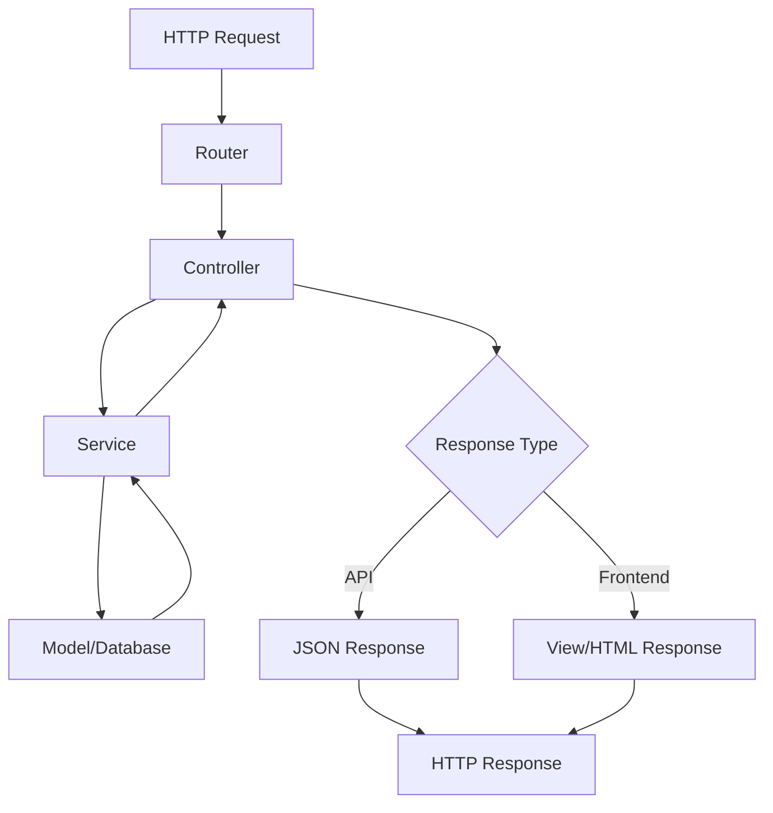

## Architecture Overview

Faster CMS plugins follow a simple request-response architecture:



## Core Components

<CardGroup cols={2}>
  <Card title="Plugin Class" icon="cube">
    Extends BasePlugin, manages lifecycle
  </Card>
  <Card title="Router" icon="route">
    Handles HTTP routing and middleware
  </Card>
  <Card title="Controllers" icon="code">
    Process requests and responses
  </Card>
  <Card title="Services" icon="gears">
    Business logic layer
  </Card>
  <Card title="Models" icon="database">
    Data models and ORM
  </Card>
  <Card title="Views" icon="window">
    Frontend templates
  </Card>
</CardGroup>

## Directory Structure

A complete plugin follows this structure:

```bash
your-plugin/
├── index.js                    # Plugin entry point
├── manifest.json               # Configuration
├── routes.js                   # Route definitions
│
├── models/                     # Database models
│   ├── index.js
│   ├── Product.js
│   └── schema.js
│
├── migrations/                 # Database migrations
│   ├── 01-create-table.js
│   └── 02-add-column.js
│
├── controllers/                # Request handlers
│   ├── frontend.js
│   ├── api.js
│   ├── data-management.js
│   └── settings.js
│
├── services/                   # Business logic
│   ├── factory.js
│   ├── product-service.js
│   └── order-service.js
│
├── middleware/                 # Custom middleware
│   └── auth.js
│
├── views/                      # Handlebars templates
│   ├── index.hbs
│   └── detail.hbs
│
├── admin/                      # React admin panel
│   ├── components/
│   └── products/
│       ├── Listing.tsx
│       └── CreateOrEdit.tsx
│
├── schema/                     # Admin schemas
│   └── admin-schema.js
│
├── assets/                     # Static files
│   ├── js/
│   ├── css/
│   └── images/
│
├── utils/                      # Helper functions
│   └── helpers.js
│
```

<Tip>
  Not all directories are required. Start with the basics and add complexity as needed.
</Tip>

## Request Flow

Understanding how requests flow through your plugin:

<Steps>
  <Step title="1. HTTP Request">
    User visits `/yourplugin/products/laptop`
  </Step>

  <Step title="2. Router Matching">
    PluginRouter matches the route pattern and executes middleware
    ```javascript
    router.public('get', '/products/:slug', controller.productDetail);
    ```
  </Step>

  <Step title="3. Middleware Execution">
    Request passes through middleware stack:
    - Cookie parsing
    - Body parsing
    - Authentication
    - Custom middleware
  </Step>

  <Step title="4. Controller">
    Controller receives request and delegates to service:
    ```javascript
    const product = await productService.getBySlug(req.params.slug);
    ```
  </Step>

  <Step title="5. Service Layer">
    Service contains business logic:
    ```javascript
    async getBySlug(slug) {
        return await Product.findOne({slug}, {withRelated: ['images']});
    }
    ```
  </Step>

  <Step title="6. Data Access">
    Model fetches from database:
    ```javascript
    return await Product.findOne({slug}, {withRelated: ['images']});
    ```
  </Step>

  <Step title="7. Response">
    Controller renders view or returns JSON:
    ```javascript
    res.render('product-detail', {product});
    ```
  </Step>
</Steps>

## Layered Architecture

### 1. Presentation Layer

Handles user interface and request/response:

<CodeGroup>
```javascript Controller (JSON API)
// controllers/api.js
const getProduct = async (req, res) => {
    const product = await productService.getById(req.params.id);
    res.json({product});
};
```

```javascript Controller (HTML View)
// controllers/frontend.js
const productDetail = async (req, res) => {
    const product = await productService.getBySlug(req.params.slug);
    res.render('product-detail', {product});
};
```
</CodeGroup>

### 2. Business Logic Layer

Services contain domain logic:

```javascript
// services/product-service.js
class ProductService {
    async getBySlug(slug) {
        // Business logic: check if active
        const product = await Product.findOne({
            slug,
            is_active: true
        });

        if (!product) {
            throw new NotFoundError('Product not found');
        }

        // Business logic: check inventory
        if (product.track_inventory && product.stock_quantity === 0) {
            product.stock_status = 'out_of_stock';
        }

        return product;
    }
}
```

### 3. Data Access Layer

Models handle database operations:

```javascript
// models/Product.js
Product = ghostBookshelf.Model.extend({
    tableName: 'products',

    images: function() {
        return this.hasMany('ProductImage');
    },

    categories: function() {
        return this.belongsToMany('Category');
    }
});
```

## Lifecycle Hooks

Your plugin integrates into the platform's lifecycle:

```javascript
class YourPlugin extends BasePlugin {
    constructor() {
        super({name: 'your-plugin', version: '1.0.0', pluginPath: __dirname});
    }

    // Called when plugin is first loaded
    async onInit() {
        this.debug('Initializing plugin');

        // Register services
        this.registerService('productService', new ProductService(this));

        // Register payment providers
        await registry.register('stripe', StripeProvider);
    }

    // Called when plugin is activated
    async onActivate() {
        this.debug('Activating plugin');

        // Register with external systems
        sitemapRegistry.register({
            name: this.name,
            sitemapUrl: '/products/sitemap.xml'
        });
    }

    // Define default settings
    getDefaultSettings() {
        return {
            currency: 'USD',
            taxRate: 0
        };
    }

    // Validate settings before save
    async _validateSettings(settings) {
        if (settings.taxRate < 0 || settings.taxRate > 100) {
            throw new ValidationError('Invalid tax rate');
        }
        return settings;
    }
}
```

## Extension Points

Your plugin can extend the platform in multiple ways:

<AccordionGroup>
  <Accordion title="Database Models" icon="database">
    Add custom tables and relationships to the database
  </Accordion>

  <Accordion title="API Endpoints" icon="cloud">
    Create new REST API endpoints with authentication
  </Accordion>

  <Accordion title="Admin UI" icon="desktop">
    Add pages to the admin panel
  </Accordion>

  <Accordion title="Frontend Pages" icon="browser">
    Create public-facing pages that integrate with themes
  </Accordion>

  <Accordion title="Middleware" icon="filter">
    Process all plugin requests with custom middleware
  </Accordion>

  <Accordion title="Events" icon="bolt">
    Listen to and emit events throughout the system
  </Accordion>

  <Accordion title="Sitemaps" icon="sitemap">
    Register custom sitemaps for SEO
  </Accordion>

  <Accordion title="Settings" icon="gear">
    Add configurable settings to your plugin
  </Accordion>
</AccordionGroup>

## Next Steps

<CardGroup cols={2}>
  <Card title="Plugin Lifecycle" icon="rotate" href="/core-concepts/plugin-lifecycle">
    Learn about lifecycle hooks and events
  </Card>
  <Card title="Routing System" icon="route" href="/core-concepts/routing-system">
    Master the routing and middleware system
  </Card>
  <Card title="Database Models" icon="database" href="/core-concepts/database-models">
    Create models and relationships
  </Card>
  <Card title="Start Building" icon="hammer" href="/building/setup">
    Begin building your plugin
  </Card>
</CardGroup>
