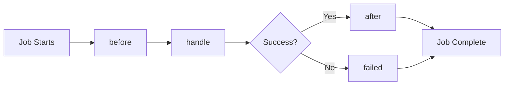

## Overview

Faster CMS provides a unified Job class for creating scheduled tasks (cron jobs) in plugins. Jobs run in isolated worker threads, providing automatic execution, logging, and error handling.

## Quick Start

### 1. Create a Job Class

Create a job file in your plugin's `jobs/` directory:

```javascript jobs/MyJob.js
const {Job} = require('@tryghost/plugin-sdk');

class MyJob extends Job {
    static config = {
        name: 'my-job',
        schedule: '0 0 * * *',
        description: 'Runs daily at midnight',
        enabled: true,
        offloaded: true
    };

    async handle() {
        this.info('Job is running');

        // Your job logic here
        const result = await this.doWork();

        return {
            success: true,
            processed: result.count
        };
    }
}

module.exports = MyJob;
```

### 2. Auto-Discovery

Jobs are automatically discovered and registered when the CMS starts. Just place your Job class file in the `jobs/` directory.

<Note>
  The plugin automatically scans the `jobs/` directory and registers all Job classes on startup.
</Note>

## Job Configuration

### Static Config Object

Every Job class must define a static `config` object:

```javascript
static config = {
    name: 'unique-job-name',        // Required: Unique identifier
    schedule: '0 * * * * *',        // Required: Cron expression
    description: 'Job description',  // Optional: Human-readable description
    enabled: true,                   // Optional: Enable/disable (default: true)
    offloaded: true                  // Optional: Run in worker thread (default: true)
};
```

### Cron Schedule Format

Cron expressions use 6 fields (including seconds):

```
┌────────────── second (0-59)
│ ┌──────────── minute (0-59)
│ │ ┌────────── hour (0-23)
│ │ │ ┌──────── day of month (1-31)
│ │ │ │ ┌────── month (1-12)
│ │ │ │ │ ┌──── day of week (0-6, Sunday=0)
│ │ │ │ │ │
* * * * * *
```

<AccordionGroup>
  <Accordion title="Common Patterns" icon="clock">
    ```javascript
    '0 */5 * * * *'    // Every 5 minutes
    '0 0 * * * *'      // Every hour
    '0 0 */2 * * *'    // Every 2 hours
    '0 0 0 * * *'      // Daily at midnight
    '0 0 2 * * *'      // Daily at 2 AM
    '0 0 0 * * 0'      // Weekly on Sunday
    '0 0 0 1 * *'      // Monthly on the 1st
    ```
  </Accordion>

  <Accordion title="Advanced Patterns" icon="star">
    ```javascript
    '0 30 9 * * 1-5'   // Weekdays at 9:30 AM
    '0 0 12 1,15 * *'  // 1st and 15th at noon
    '0 */10 9-17 * * *' // Every 10 min, 9 AM-5 PM
    '0 0 0 1 1 *'      // January 1st (yearly)
    ```
  </Accordion>
</AccordionGroup>

## Job Lifecycle

Jobs follow a defined lifecycle with hooks you can override:



### handle()

The main job handler - **required** to be implemented:

```javascript
async handle() {
    // Your job logic here
    const data = await this.fetchData();
    const result = await this.processData(data);

    return {
        success: true,
        processed: result.count,
        errors: result.errors
    };
}
```

<Warning>
  The `handle()` method must be implemented or the job will throw an error.
</Warning>

### before()

Called before the job starts - use for setup tasks:

```javascript
async before() {
    this.info('Preparing job execution');

    // Setup resources
    this.startTime = Date.now();
    this.db = await this.connectDatabase();
}
```

### after()

Called after successful completion - use for cleanup:

```javascript
async after(result) {
    this.info(`Job completed: ${result.processed} items processed`);

    // Cleanup resources
    await this.db.close();
}
```

### failed()

Called when the job fails - use for error handling:

```javascript
async failed(error) {
    this.error('Job failed', error);

    // Cleanup and notify
    await this.db.rollback();
    await this.notifyAdmin(error);
}
```

## Logging

Jobs have built-in logging methods that automatically format messages:

```javascript
async handle() {
    this.info('Starting data sync');
    this.debug('Processing 100 records');
    this.warn('Rate limit approaching');
    this.error('API request failed', error);
}
```

<Tip>
  All log messages are automatically prefixed with `[job-name]` for easy filtering.
</Tip>

### Log Levels

<CardGroup cols={2}>
  <Card title="info(message)" icon="circle-info">
    General information about job progress
  </Card>
  <Card title="debug(message)" icon="bug">
    Detailed debugging information
  </Card>
  <Card title="warn(message)" icon="triangle-exclamation">
    Warning messages for non-critical issues
  </Card>
  <Card title="error(message, error)" icon="circle-exclamation">
    Error messages with optional Error object
  </Card>
</CardGroup>

## Utility Methods

### Time Tracking

```javascript
async handle() {
    // Get elapsed time in milliseconds
    const elapsed = this.getElapsedTime();

    // Get formatted elapsed time (e.g., "2.5s" or "150ms")
    const formatted = this.getElapsedTimeFormatted();

    this.info(`Processing took ${formatted}`);
}
```

### Job Name

```javascript
async handle() {
    const name = this.getName(); // Returns static config.name
    this.info(`Running ${name}`);
}
```

### Job Data

Access data passed to the job:

```javascript
async handle() {
    // Access data passed when job was scheduled
    const customData = this.data.customParam;
}
```

## Complete Example

Here's a complete example of a data cleanup job:

```javascript jobs/DataCleanupJob.js
const {Job} = require('@tryghost/plugin-sdk');
const {Record} = require('../models/record');

class DataCleanupJob extends Job {
    static config = {
        name: 'data-cleanup',
        schedule: '0 0 2 * * *',
        description: 'Remove expired records from database',
        enabled: true,
        offloaded: true
    };

    async before() {
        this.info('Preparing data cleanup');
        this.startTime = Date.now();
    }

    async handle() {
        const expirationDays = 30;

        this.info(`Starting cleanup (expiration: ${expirationDays} days)`);

        const expirationDate = new Date();
        expirationDate.setDate(expirationDate.getDate() - expirationDays);
        const expirationISO = expirationDate.toISOString();

        const expiredRecords = await Record.findAll({
            filter: `status:expired+updated_at:<${expirationISO}`
        });

        if (!expiredRecords || expiredRecords.length === 0) {
            this.info('No expired records found');
            return {
                success: true,
                deleted: 0,
                message: 'No expired records found'
            };
        }

        this.info(`Found ${expiredRecords.length} expired record(s) to remove`);

        let deletedCount = 0;
        let errorCount = 0;

        for (const record of expiredRecords.models) {
            try {
                const recordId = record.get('id');
                await record.destroy();
                deletedCount++;

                this.debug(`Deleted record ${recordId}`);
            } catch (error) {
                errorCount++;
                this.error(`Error deleting record ${record.get('id')}`, error);
            }
        }

        this.info(`Successfully deleted ${deletedCount} record(s), ${errorCount} error(s)`);

        return {
            success: true,
            deleted: deletedCount,
            errors: errorCount,
            expirationDays: expirationDays,
            message: `Deleted ${deletedCount} expired record(s)`
        };
    }

    async after(result) {
        const elapsed = this.getElapsedTimeFormatted();
        this.info(`Cleanup completed: ${result.deleted} records removed in ${elapsed}`);
    }

    async failed(error) {
        this.error('Data cleanup failed', error);
    }
}

module.exports = DataCleanupJob;
```

## Best Practices

<AccordionGroup>
  <Accordion title="Keep Jobs Focused" icon="bullseye">
    - Each job should have a single, clear purpose
    - Break complex tasks into multiple jobs
    - Use descriptive job names
    - Document what the job does
  </Accordion>

  <Accordion title="Handle Errors Gracefully" icon="shield">
    - Use try-catch for individual operations
    - Log errors but continue processing when possible
    - Implement the `failed()` hook for cleanup
    - Return meaningful error information
  </Accordion>

  <Accordion title="Be Mindful of Performance" icon="gauge">
    - Process data in batches for large datasets
    - Avoid long-running jobs (>10 minutes)
    - Use database indexes for queries
    - Consider job frequency vs data volume
  </Accordion>

  <Accordion title="Log Appropriately" icon="list">
    - Use `info()` for major milestones
    - Use `debug()` for detailed operations
    - Use `warn()` for recoverable issues
    - Use `error()` for failures
    - Include counts and timing information
  </Accordion>

  <Accordion title="Test Thoroughly" icon="flask">
    - Test with various data volumes
    - Test failure scenarios
    - Verify cleanup in `failed()` hook
    - Monitor job execution in production
  </Accordion>
</AccordionGroup>

## Disabling Jobs

Temporarily disable a job by setting `enabled: false`:

```javascript
static config = {
    name: 'my-job',
    schedule: '0 * * * * *',
    enabled: false  // Job won't run
};
```

<Info>
  Disabled jobs are skipped during registration. Change this setting and restart the CMS to re-enable.
</Info>

## Worker Threads

Jobs run in isolated worker threads by default (`offloaded: true`), which:

- Prevents blocking the main CMS process
- Provides better error isolation
- Allows parallel job execution
- Improves overall system stability

<Warning>
  Setting `offloaded: false` runs the job in the main process. Only use this for very quick operations (&lt;100ms).
</Warning>

## Troubleshooting

### Job Not Running

1. **Check job is enabled:**
   ```javascript
   enabled: true
   ```

2. **Verify cron schedule:**
   ```javascript
   schedule: '0 * * * * *'  // Must be valid 6-field format
   ```

3. **Check logs for errors:**
   ```bash
   # View CMS logs
   tail -f content/logs/[filename].log
   ```

4. **Verify file location:**
   ```
   your-plugin/
   └── jobs/
       └── YourJob.js  ✓ Correct
   ```

### Job Failing

1. **Check the `failed()` hook logs**
2. **Verify database connections**
3. **Check required models are available**
4. **Ensure async operations are awaited**
5. **Review worker thread logs**

### Logs Not Appearing

1. **Use logging methods:**
   ```javascript
   this.info('message');  // ✓ Correct
   console.log('message'); // ✗ Won't appear in logs
   ```

2. **Check worker thread communication**
3. **Verify parentPort is available**

## Advanced Patterns

### Conditional Processing

```javascript
async handle() {
    const settings = this.data.settings;

    if (!settings.featureEnabled) {
        this.info('Feature disabled, skipping');
        return { skipped: true };
    }

    // Process when enabled
    return await this.processData();
}
```

### Batch Processing

```javascript
async handle() {
    const BATCH_SIZE = 100;
    const items = await this.fetchAllItems();

    for (let i = 0; i < items.length; i += BATCH_SIZE) {
        const batch = items.slice(i, i + BATCH_SIZE);
        await this.processBatch(batch);
        this.info(`Processed ${i + batch.length}/${items.length}`);
    }
}
```

### Rate Limiting

```javascript
async handle() {
    const items = await this.fetchItems();

    for (const item of items) {
        await this.processItem(item);

        // Wait 100ms between items to avoid rate limits
        await new Promise(resolve => setTimeout(resolve, 100));
    }
}
```

## Next Steps

<CardGroup cols={2}>
  <Card title="Plugin Lifecycle" icon="rotate" href="/core-concepts/plugin-lifecycle">
    Learn about plugin initialization
  </Card>
  <Card title="Database Models" icon="database" href="/core-concepts/models">
    Work with database models in jobs
  </Card>
  <Card title="Services" icon="gears" href="/building/services">
    Organize business logic with services
  </Card>
  <Card title="Examples" icon="code" href="/examples">
    See complete working examples
  </Card>
</CardGroup>
