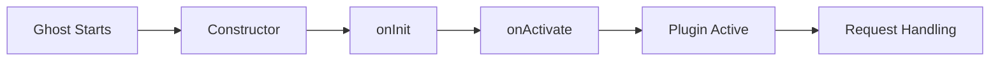

## Overview

Every Faster CMS plugin follows a defined lifecycle from initialization to activation. Understanding these hooks allows you to properly initialize services, register providers, and integrate with the Ghost ecosystem.

## Lifecycle Stages



## Constructor

The constructor is called first when Ghost loads your plugin.

```javascript
class MyPlugin extends BasePlugin {
    constructor() {
        super({
            name: 'my-plugin',
            version: '1.0.0',
            pluginPath: __dirname
        });

        // Initialize instance variables
        this.services = {};
        this.providers = new Map();
    }
}
```

<Warning>
  Do NOT perform async operations or database queries in the constructor. Use `onInit()` for that.
</Warning>

## onInit() Hook

Called when the plugin is initialized. This is where you:
- Register services
- Register providers
- Set up internal state

```javascript
async onInit() {
    this.debug('Initializing plugin');

    // 1. Register services
    const MyService = require('./services/my-service');
    this.registerService('myService', new MyService(this));

    // 2. Initialize any async resources
    await this.services.myService.init();

    this.debug('Plugin initialized successfully');
}
```

<Tip>
  `onInit()` runs on every Ghost restart, so make it idempotent (safe to run multiple times).
</Tip>

## onActivate() Hook

Called when the plugin is activated. Use this to:
- Register with external systems
- Register sitemaps
- Set up webhooks
- Perform one-time setup

```javascript
async onActivate() {
    this.debug('Activating plugin');

    // Register sitemap for SEO
    try {
        const pluginSitemapRegistry = require('../../../core/server/services/plugin-sitemap-registry');
        pluginSitemapRegistry.register({
            name: this.name,
            sitemapUrl: '/your-plugin/sitemap.xml',
            lastModified: new Date()
        });
        this.debug('Sitemap registered successfully');
    } catch (error) {
        this.debug('Failed to register sitemap:', error.message);
    }

    this.debug('Plugin activated');
}
```

<Note>
  `onActivate()` may be called less frequently than `onInit()`. It's triggered when the plugin is first enabled or when Ghost is restarted.
</Note>

## Service Registration

Register services that can be accessed throughout your plugin:

```javascript
async onInit() {
    // Register a service
    this.registerService('productService', new ProductService(this));

    // Access the service later
    const service = this.getService('productService');
}
```

<AccordionGroup>
  <Accordion title="Built-in Services" icon="layer-group">
    Your plugin has access to Ghost's built-in services:
    - `database` - Database connection
    - `logger` - Logging service
    - `events` - Event emitter
    - `settings` - Settings management
  </Accordion>

  <Accordion title="Custom Services" icon="plus">
    Register your own services in `onInit()`:
    ```javascript
    this.registerService('myService', new MyService(this));
    ```
  </Accordion>
</AccordionGroup>

## Settings Management

### Default Settings

Define default settings for your plugin:

```javascript
getDefaultSettings() {
    return {
        enabled: true,
        api_key: '',
        max_items: 100,
        enable_cache: true,
        advanced_options: {
            option_one: 'value1',
            option_two: true
        }
    };
}
```

### Settings Validation

Validate settings before they're saved:

```javascript
async _validateSettings(settings) {
    const validated = {...settings};

    // Validate string field
    if (settings.api_key && typeof settings.api_key !== 'string') {
        throw new errors.ValidationError({
            message: 'API key must be a string'
        });
    }

    // Validate numeric field
    if (settings.max_items !== undefined) {
        const maxItems = parseInt(settings.max_items);
        if (isNaN(maxItems) || maxItems < 1 || maxItems > 1000) {
            throw new errors.ValidationError({
                message: 'max_items must be between 1 and 1000'
            });
        }
    }

    // Validate nested settings
    if (settings.advanced_options) {
        if (typeof settings.advanced_options.option_two !== 'boolean') {
            throw new errors.ValidationError({
                message: 'option_two must be a boolean'
            });
        }
    }

    return validated;
}
```

### Accessing Settings

```javascript
// In your plugin class
const settings = this.getSettings();
console.log(settings.enabled); // true

// In controllers or services
const plugin = require('../index');
const settings = plugin.getSettings();
```

## Asset Management

Enqueue JavaScript and CSS assets for frontend pages:

```javascript
getAssets(viewManager) {
    // Enqueue JavaScript
    viewManager.enqueueAsset('my-plugin-script', 'js/main.js', {
        type: 'script',
        order: 10,
        pluginName: this.name
    });

    // Enqueue CSS
    viewManager.enqueueAsset('my-plugin-styles', 'css/styles.css', {
        type: 'style',
        order: 5,
        pluginName: this.name
    });
}
```

<Info>
  Assets are loaded from your plugin's `assets/` directory and injected into theme pages.
</Info>

## Debug Logging

Use the built-in debug logger:

```javascript
async onInit() {
    this.debug('Starting initialization');
    this.debug('Settings:', this.getSettings());
    this.debug('Plugin path:', this.pluginPath);
}
```

Enable debug logs when running Ghost:

```bash
DEBUG=ghost:* ghost start
# Or for specific plugin
DEBUG=ghost:plugin:my-plugin ghost start
```

## Best Practices

<AccordionGroup>
  <Accordion title="Keep onInit() Fast" icon="bolt">
    - Avoid heavy computations
    - Don't load large datasets
    - Use lazy loading for optional features
    - Cache expensive operations
  </Accordion>

  <Accordion title="Handle Errors Gracefully" icon="shield">
    - Wrap external integrations in try-catch
    - Log errors but don't crash Ghost
    - Provide fallbacks for failed services
    - Use meaningful error messages
  </Accordion>

  <Accordion title="Make Operations Idempotent" icon="repeat">
    - `onInit()` runs on every restart
    - Check if resources already exist
    - Don't duplicate registrations
    - Clean up old state if needed
  </Accordion>

  <Accordion title="Use Debug Logging" icon="bug">
    - Log all lifecycle events
    - Log service registrations
    - Log configuration values (not secrets!)
    - Help users troubleshoot issues
  </Accordion>
</AccordionGroup>

## Common Patterns

### Conditional Service Registration

```javascript
async onInit() {
    const settings = this.getSettings();

    // Only register if feature is enabled
    if (settings.feature_enabled) {
        this.registerService('featureService', new FeatureService(this));
    }

    // Register different service based on environment
    if (process.env.NODE_ENV === 'production') {
        this.registerService('cache', new ProductionCache(this));
    } else {
        this.registerService('cache', new DevelopmentCache(this));
    }
}
```

### Lazy Service Loading

```javascript
class MyPlugin extends BasePlugin {
    getMyService() {
        if (!this._myService) {
            this._myService = new MyService(this);
        }
        return this._myService;
    }
}
```

### Error Recovery

```javascript
async onActivate() {
    // Try optional operation, but don't fail if it doesn't work
    try {
        await this.registerExternalService();
    } catch (error) {
        this.debug('External service registration failed, continuing anyway:', error.message);
    }

    // Critical operation - fail if it doesn't work
    try {
        await this.initializeResources();
    } catch (error) {
        throw new errors.InternalServerError({
            message: 'Failed to initialize resources',
            err: error
        });
    }
}
```

## Next Steps

<CardGroup cols={2}>
  <Card title="Routing System" icon="route" href="/core-concepts/routing-system">
    Learn how to create routes and middleware
  </Card>
  <Card title="Database Models" icon="database" href="/core-concepts/models">
    Create and manage database models
  </Card>
  <Card title="Services" icon="gears" href="/core-concepts/services">
    Organize business logic with services
  </Card>
</CardGroup>
